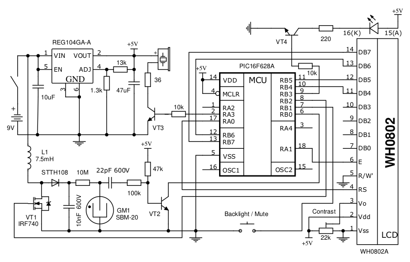

# geiger_f628a_8x2
geiger counter built on PIC16F628A MCU and HD44780-based LCD 8x2

modded geiger conter on PIC14 series MCU by TOTHEMA Software.

initially described here:
https://vrtp.ru/index.php?act=categories&CODE=article&article=2420

discussion board:
https://vrtp.ru/index.php?showtopic=15990

minimized electrical/digital parts number by modding PIC firmware.

binary firmware is geiger_f628a_8x2_X.X_YYkhz.hex, where X.X - version, YY - frequency of high voltage boost clock, depends on which inductor you used. i use 10kHz with 7.5mH, but it would be better to measure the voltage on the Geiger tube. it should be around 400V in the power supply range of 7-9V.

- key pressed on startup (when display shows "geiger counter") - switch sound on/off (stored to EEPROM);
- key pressed when "geiger counter" disappears - high voltage boost will run constantly;
- short keypress - turn on backlight for 3 sec;
- long (>1.5 sec) keypress - switch rate/dose display.
